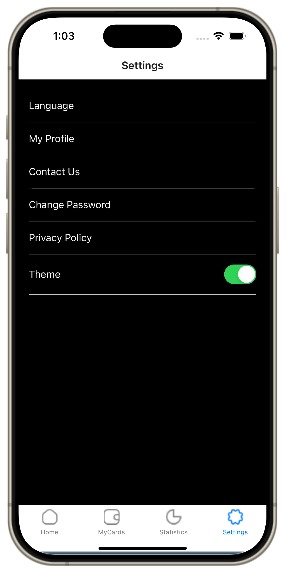
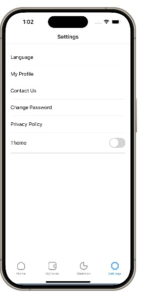
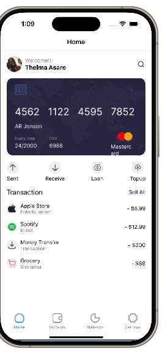
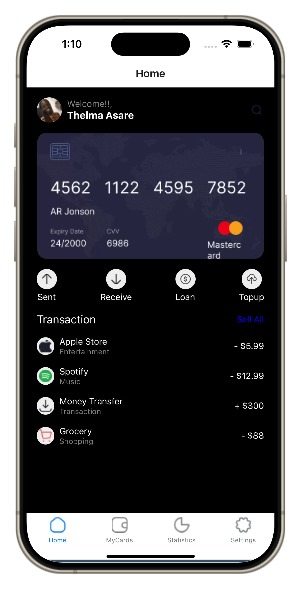

# rn-assignment5-11124414
## Student ID: 11124414
 
## Screenshots of Apps

## Screenshot of Settings In DarkMode

## Screenshot Of Settings In LightMode

 
 ## Screenshots Of HomePage In LightMode

 

## Screenshots of HomePage In DarkMode

## Description of how App Was built 

## App Overview:
The app is a mobile application developed using React Native,This app was developed in my Visual Studio code and viewed using Expo Go on my phone

## Home Screen:
The home screen is the central hub of the app, offering a user-friendly interface that provides instant access to essential features. The screen is intuitively divided into separate sections, starting with a visually appealing header that showcases a personalized profile image, a warm welcome message, and a search icon for easy navigation. Below the header, a prominent card image takes center stage, accompanied by a scrollable list of transactions that allows for effortless browsing and exploration.

## Settings Screen:
The settings screen offers users the flexibility to customize their app experience by selecting either a light or dark theme. Within the settings options, a dedicated "Theme" section features a convenient toggle switch, enabling users to seamlessly switch between the two themes and personalize their app appearance to suit their preferences.

## Styling:
I leveraged Styled Components, a popular and versatile styling library for React, to define the visual aesthetic of my application. By utilizing this approach, I was able to create modular, reusable, and maintainable styling components, simplifying the process of updating and refining the app's design while promoting consistency and efficiency.

## Features:
The app includes the followiung features;

The app features a user-centric home screen with a personalized profile section, a prominent card image, and a scrollable transaction list. Additionally, a dedicated Settings screen offers a convenient theme toggle, enabling users to dynamically switch between a sleek light theme and a dramatic dark theme. Furthermore, the app utilizes styled components, ensuring a modular and reusable styling approach that streamlines design maintenance and updates

